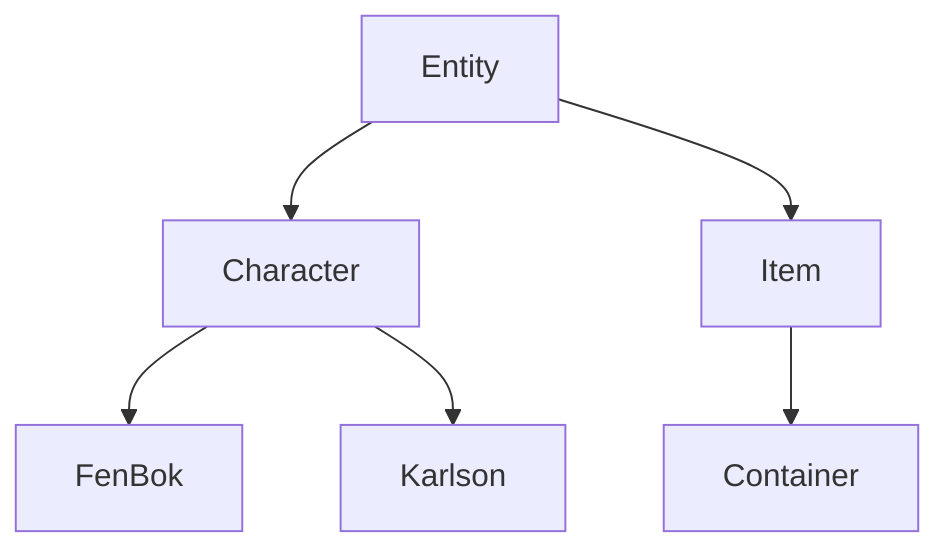
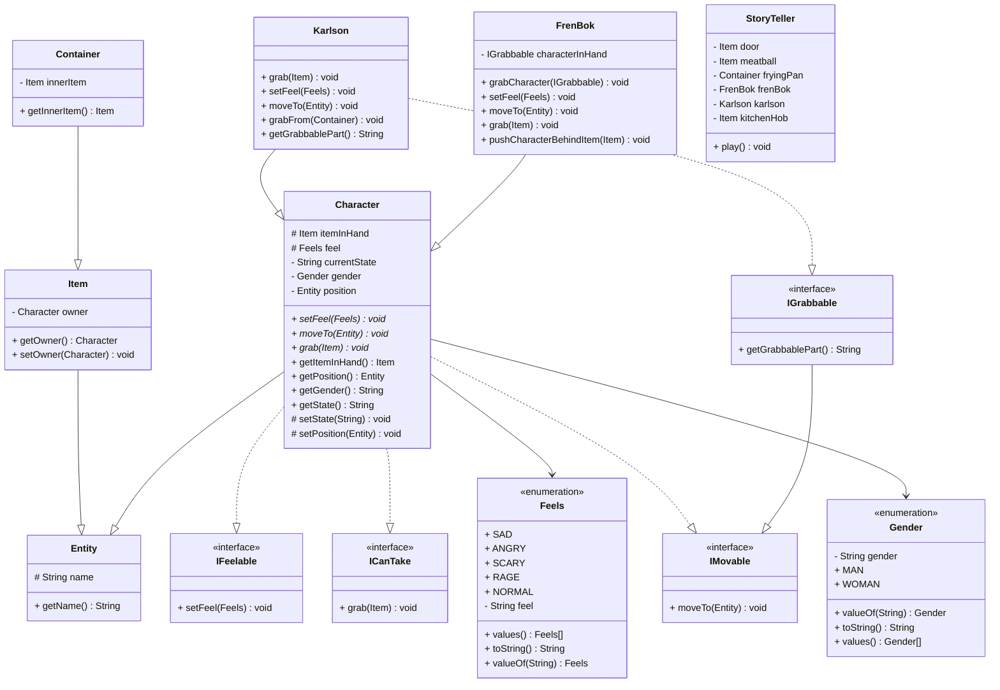

## Выполнял
**ФИ:** Зинченко Иван

**ИСУ:** 408657

**Вариант:** 528475

## Задание

> У Карлсона дрогнули губы, и он надулся. Он сделал шаг к плите и взял со сковородки одну тефтельку. Вот этого ему не следовало делать. Фрекен Бок взревела от бешенства и кинулась на Карлсона, схватила его за шиворот и вытолкнула за дверь. 

## Вывод программы

```
Кралсон дрогнул губой
Кралсон надулся
Он сделал шаг к плита
Кралсон взял одну тефтелька из сковородка
Вот этого ему не следовало делать
Фрекен Бок взревела от бешенства
Она кинулась к Кралсон
Она схватила Кралсон за шиворот
Она вытолкнула Кралсон за дверь
```

## Структура проекта

Главный абстрактный класс - Entity, который имеет только имя. От него наследуются предметы и персонажи. Персонажи могут чувствовать *(IFeelabe)*, двигаться *(IMovable)* и брать вещи *(ITakeable)*. Также персонажи имеют гендер *(enum Feels)*.

За историю отвечает класс *StoryTeller*. Он меняет состояние персонажей и отображает их состояние.

## UML Диаграмма
